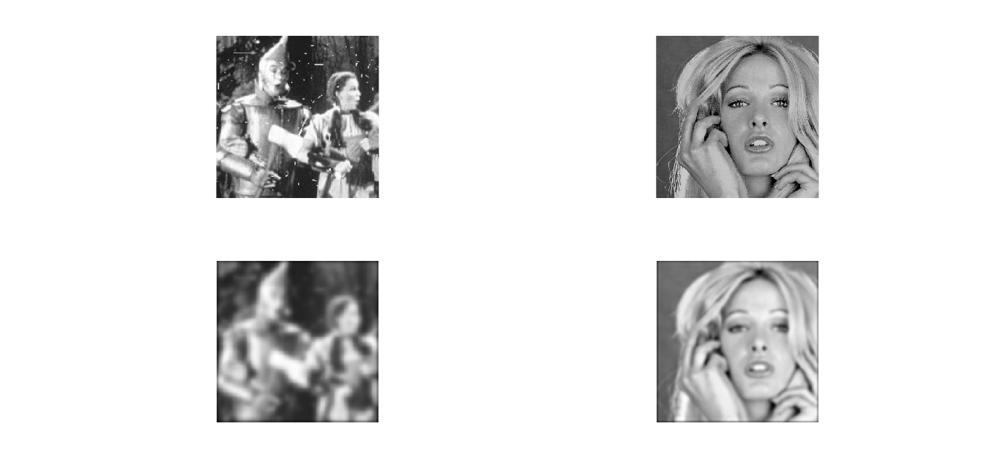
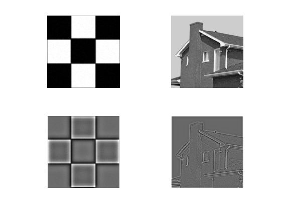
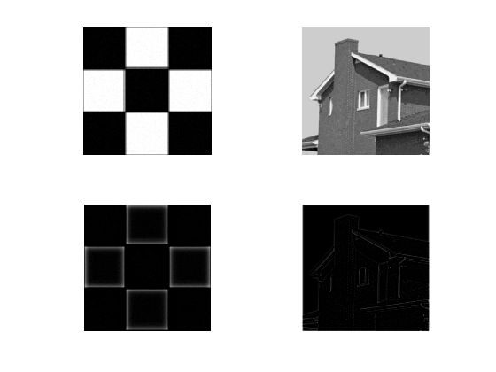
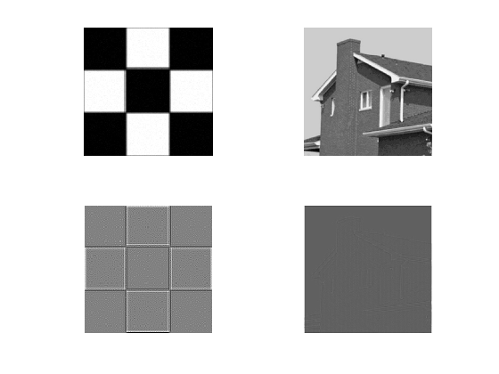

数字图像处理实验报告

自动化64               2160504103           魏慎行

摘要

   本次作业使用MATLAB实现频域低通滤波器（包括butterworth滤波器和gaussian滤波器）、频域高通滤波器（Butterworth、Gaussian）以及拉普拉斯算子和UnMask滤波器，并计算了功率谱比。

****1、频率低通滤波器****  
  设计低通滤波器包括 butterworth and Gaussian (选择合适的半径，计算功率谱比),平滑测试图像test1和2;分析各自优缺点

 **频域滤波步骤：**  
 1、确定填充参数，通常选取P=2*M，Q=2*N  
 2、添加必要的0，形成填充后的图像  
 3、将变换后的图像移到变换中心  
 4、做FFT变换得到频域  
 5、形成滤波器函数，中心在（P/2,Q/2)处,用阵列相乘得到G  
 6、将图像移动回原处并做反变换，取实部后得到图像  
 7、对图像截取左上角得到处理结果 

在本次实验中半径D0选择根据图像大小改变而改变，取值为0.05倍的频域阵列长度

 Butterworth Low Pass滤波器：  
 根据低通函数，本实验中选择的是2阶滤波器，确定H并进行滤波  
 结果如下

  

 Gaussian Low Pass滤波器函数：  
 结果如下：

 

 **功率谱比：**  
 根据课本公式定义，该指标为滤波器保留的频域能量占总频域能量的比例  
 计算可得    
  test1的  
  ans =

    0.9536

  test2的  
  ans =

    0.9816

**优缺点分析：**  
 对比两种低通滤波器可以得知，二者的基本效果相同，都是对图像进行平滑处理，滤除高频分量保留低频分量，图像变得模糊。
 由于两个滤波器在过滤带处存在不同，因此两个滤波器的功率谱并不相同，从实验结果来看，在相同D0选取下，Gaussian滤波器的效果要好于Butterworth滤波器。

****2、频率域高通滤波器****  
设计高通滤波器包括butterworth and Gaussian，在频域增强边缘。选择半径和计算功率谱比，测试图像test3,4：分析各自优缺点；  
频率域高通滤波的基本步骤与上低通滤波相同，主要需要修改滤波器的传递函数H(u,v)。

**实验结果：**  
  二阶ButterWorth High Pass ：  

  

  Gaussian高通滤波器：

  

**功率谱比：**  
 D0=0.05*length(F)  

 test3:  

 ans =

    0.0665

 test4:

ans =

    0.0171

**结果对比：**   
 二者的效果基本一致，滤除低频分量，保留高频分量。图像的边缘得到强化。从功率谱比来看，图像的能量大多存在于低频部分，高频部分保留能量较少。 
 Gaussian滤波器的背景明显黑与ButterWorth滤波器，低频部分滤除较多，因此在D0相同情况下，Gaussian滤波器效果较好。

****3、其它高通滤波器****  
 （1）拉普拉斯高通滤波器：  
    根据拉普拉斯传递函数进行图像滤波(未进行归一化)  
    结果如下：  
    
  （2）UnMask：  
  将图像模糊部分去除后进行图像增强  
    结果如下：  
    

**比较分析：**  
由于拉普拉斯滤波器将原始图像完全加入到滤波结果中，因此解决了零频率成分问题，图像背景的平均强度增加、变亮。但是也引入了噪声信息，使图像出现了一定程度的失真。  
UnMask则使图像的边缘更加清晰，但同时也带来了过度锐化的问题，出现了多重轮廓。

****空域与频域滤波****  
空间域和频域滤波间的纽带是卷积定理。空间域中的滤波定义为滤波函数h（x，y）与输入图像f（x，y）进行卷积；频率域中的滤波定义为滤波函数H（u，v）与输入图像的傅里叶变换F（u，v）进行相乘。空间域的滤波器和频率域的滤波器互为傅里叶变换。 频域增强技术与空域增强技术有密切的联系。一方面，许多空域增强技术可借助频域概念来分析和帮助设计；另一方面，许多空域增强技术可转化到频域实现，而许多频域增强技术可转化到空域实现。空域滤波主要包括平滑滤波和锐化滤波。平滑滤波是要滤除不规则的噪声或干扰的影响，从频域的角度看，不规则的噪声具有较高的频率，所以可用具有低通能力的频域滤波器来滤除。由此可见空域的平滑滤波对应频域的低通滤波。锐化滤波是要增强边缘和轮廓处的强度，从频域的角度看，边缘和轮廓处都具有较高的频率，所以可用具有高通能力的频域滤波器来增强。由此可见，空域的锐化滤波对应频域的高通滤波。频域里低通滤波器的转移函数应该对应空域里平滑滤波器的模板函数的傅里叶变换。频域里高通滤波器的转移函数应该对应空域里锐化滤波器的模板函数的傅里叶变换。即空域和频域的滤波器组成傅里叶变换对。给定一个域内的滤波器，通过傅里叶变换或反变换得到在另一个域内对应的滤波器。空域的锐化滤波或频域的高通滤波可用两个空域的平滑滤波器或两个频域的低通滤波器实现。在频域中分析图像的频率成分与图像的视觉效果间的对应关系比较直观。空域滤波在具体实现上和硬件设计上有一定优点。区别：例如，空域技术中无论使用点操作还是模板操作，每次都只是基于部分像素的性质，而频域技术每次都利用图像中所有像素的数据，具有全局性，有可能更好地体现图像的整体特性，如整体对比度和平均灰度值等。
